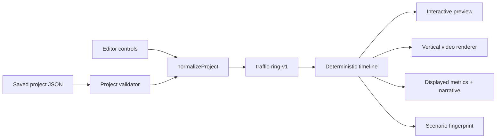

# Kinetic

**Executable explainers from one deterministic timeline.** Kinetic is a browser-based editor where the interactive simulation, displayed metrics, saved project, and exported vertical video are all grounded in the same model state instead of being separate hand-authored approximations.

> Current bounded release: `traffic-ring-v1`, a simplified educational ring-road traffic model. It is intentionally **not** a calibrated traffic forecasting system.

## What works now

- Edit traffic density, reaction time, braking, duration, seed, and project name live.
- Scrub or play the exact deterministic timeline used by export.
- Inspect average speed, minimum speed, wave strength, vehicle count, and a short frame-level narrative.
- Save a versioned `kinetic-project-v1` JSON project and load it later.
- Reject malformed, unsupported-schema, unsupported-model, and out-of-range project files instead of silently coercing them.
- Export a 720×1280 WebM whose rendered frames carry the selected assumptions and scenario fingerprint.
- Cancel an in-progress export and surface unsupported-browser/export errors.
- Reproduce checked-in synthetic scenarios with stable fingerprints.

## Architecture



The important constraint is the center of the diagram: preview and export do **not** run different simulations. `buildTimeline()` creates one deterministic frame sequence from normalized project parameters and seed, and both surfaces consume it.

## Quick start

Requires Node.js 20+ and no runtime npm dependencies.

```bash
git clone https://github.com/shlbi/kinetic.git
cd kinetic
npm test
npm run build
npm start
```

Then open the local URL printed by the server. The production-like static output is written to `dist/` by `npm run build`.

## Reproducible demos

Two synthetic projects live in [`examples/`](examples/):

| Scenario | Density | Reaction | Braking | Seed | Expected fingerprint |
| --- | ---: | ---: | ---: | ---: | --- |
| Sparse Ring | 0.34 | 0.70 s | 4.2 m/s² | 11 | `9c47fc48` |
| Dense Ring | 0.78 | 1.70 s | 2.4 m/s² | 77 | `217e2608` |

The test suite parses these files through the same project validator used by the editor and rebuilds each timeline twice to confirm deterministic reproduction.

## Project format

Saved files identify both the document schema and the bounded simulation model:

```json
{
  "schema": "kinetic-project-v1",
  "name": "Traffic Wave Study",
  "model": "traffic-ring-v1",
  "seed": 42,
  "parameters": {
    "density": 0.58,
    "reaction": 1.1,
    "braking": 2.8,
    "duration": 18,
    "fps": 30
  }
}
```

Imports are validated before the current editor state is changed. Unknown schema/model versions are rejected explicitly so a future model cannot accidentally be interpreted as `traffic-ring-v1`.

## Verification observed on the repository

The latest GitHub Actions verification at the time of this README ran on Node 24 and passed **17 tests with 0 failures**, followed by a successful static build. The suite covers deterministic timelines, fingerprints, finite/non-negative vehicle state, timeline clamping, strict project-file validation, and the two reproducible examples.

A real browser/export verification was also performed earlier in the project cycle: Chromium exercised live controls, save/load, and cancellation; a generated VP9 WebM opened with `ffprobe`, decoded with `ffmpeg`, was 720×1280, carried the matching scenario fingerprint, and its decoded first frame closely matched the corresponding editor frame. Detailed observed records are kept in [`.nightshift/STATE.json`](.nightshift/STATE.json) and [`docs/verification/`](docs/verification/).

## Model assumptions

`traffic-ring-v1` uses a 1,000-unit closed ring, deterministic initial velocities from a seeded PRNG, local leader-gap following rules, a bounded acceleration/deceleration rule, and one deterministic initial slowdown to seed a wave. Density changes vehicle count; reaction and braking affect the simplified safe-gap response.

This is useful for explaining how a local perturbation can propagate in a bounded toy system. It should **not** be used to predict a specific road, driver population, crash risk, travel time, or policy outcome.

## Known limitations

- The traffic model is pedagogical rather than calibrated against real traffic data.
- Browser `MediaRecorder` timestamps are wall-clock based, so WebM container duration can differ slightly from the deterministic model duration even when the frames come from the same timeline.
- WebM export depends on the browser exposing `MediaRecorder`, canvas capture, and a supported WebM codec.
- Kinetic currently supports one bounded simulation model. A second model will not be added until this first vertical slice is release-ready.
- Repository-owned screenshots and a captured demo are deliberately still pending; they will be captured from the working editor rather than mocked or fabricated.

## Technical decisions worth discussing in an interview

1. **Determinism over animation tricks.** A project seed and normalized parameters define the timeline and fingerprint, making results reproducible and testable.
2. **One timeline, multiple surfaces.** Preview, metrics, narrative, and video rendering consume the same frame sequence.
3. **Versioned persistence.** Saved projects carry both schema and model versions, with strict import validation rather than implicit migrations.
4. **Zero runtime dependencies.** The current vertical slice builds and serves with Node scripts and browser APIs, keeping the demo easy to inspect and run.
5. **Observed verification over badges.** Browser behavior and the exported media file are checked directly; unsupported or unexecuted checks are documented as such.

## Repository map

```text
index.html                 Editor shell and visual system
src/editor/app.js          Editor state, playback, persistence, export
src/project/format.js      Versioned project parser/serializer
src/sim/model.js           Deterministic traffic-ring model and timeline
examples/                  Reproducible project fixtures
scripts/                   Zero-dependency build and local server
tests/                     Model, project-format, and fixture tests
docs/verification/         Observed browser/media verification notes
.nightshift/STATE.json     Acceptance status and implementation handoff
```

## Next release work

The next work is presentation and release hardening: capture real repository-owned screenshots/demo media from the verified editor, tighten accessibility/polish, and turn the observed verification into a concise interview walkthrough. The scope remains `traffic-ring-v1` until that vertical slice is complete.
